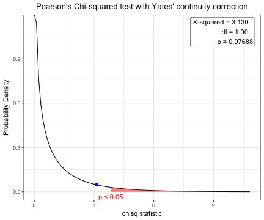
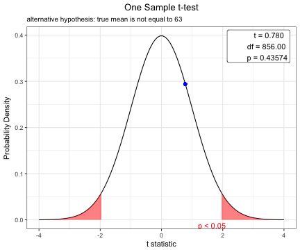
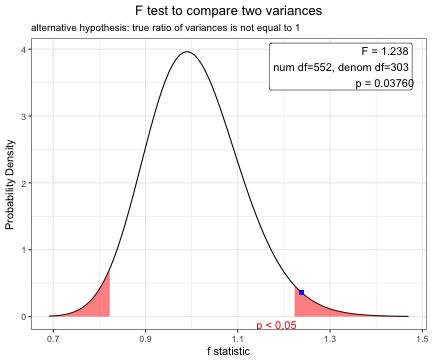
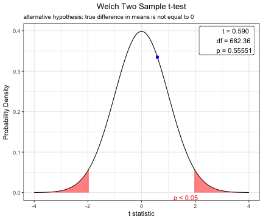
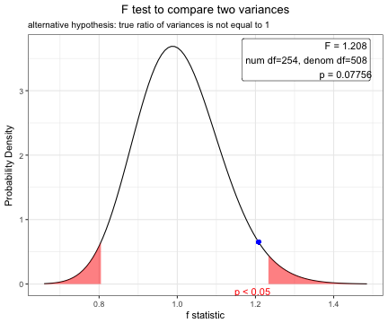
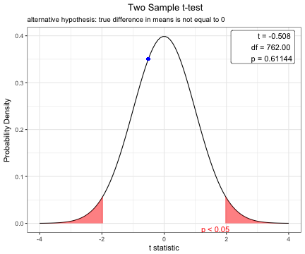
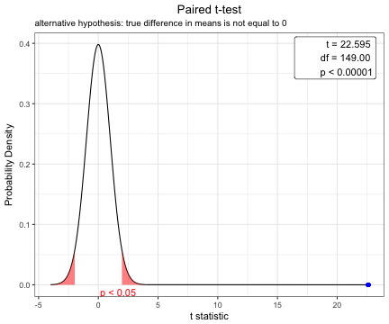

To understand the concept of p value is very important. To teach the the distribution of common statistic( $\chi^2$ for chisq.test() , t for Student's t-test , F for F-test) and concept of the p-value, plot.htest() function can be used.

## Package Installation

You can install this package form the github. Currently, package `webr` is under construction and consists of only one function - plot.htest().   


```r
#install.packages("devtools")
devtools::install_github("cardiomoon/webr")
```

## Coverage of plot.htest() 

The plot.htest() function is a S3 method for class "htest". Currently, this function covers Welch Two Sample t-test, Pearson's Chi-squared test, Two Sample t-test, One Sample t-test, Paired t-test and F test to compare two variances.
 

## For Chi-squared Test

You can show the distribution of chi-squre statistic and p-value. 


```r
 require(moonBook)
 require(webr)
 
 # chi-squared test
 x=chisq.test(table(acs$sex,acs$DM))
 x
```

```

	Pearson's Chi-squared test with Yates' continuity correction

data:  table(acs$sex, acs$DM)
X-squared = 3.1296, df = 1, p-value = 0.07688
```

```r
 plot(x)
```



## For one sample t-test

You can show the distribution of t-statistic and p-value in one sample t-test.


```r
t.test(acs$age,mu=63)
```

```

	One Sample t-test

data:  acs$age
t = 0.77978, df = 856, p-value = 0.4357
alternative hypothesis: true mean is not equal to 63
95 percent confidence interval:
 62.52736 64.09574
sample estimates:
mean of x 
 63.31155 
```

```r
plot(t.test(acs$age,mu=63))
```


 
## Student t-test to compare means for two independent samples

Before performing a t-test, you have to compare two variances.

### F test to compare two variances


```r
x=var.test(age~DM,data=acs)
x
```

```

	F test to compare two variances

data:  age by DM
F = 1.2383, num df = 552, denom df = 303, p-value = 0.0376
alternative hypothesis: true ratio of variances is not equal to 1
95 percent confidence interval:
 1.012416 1.505776
sample estimates:
ratio of variances 
          1.238288 
```

```r
plot(x)
```



### Use for Two Sample t-test for independence samples 

Based on the result of var.test(), you can perform t.test with default option(var.equal=FALSE).

```r
x=t.test(age~DM,data=acs)
x
```

```

	Welch Two Sample t-test

data:  age by DM
t = 0.58982, df = 682.36, p-value = 0.5555
alternative hypothesis: true difference in means is not equal to 0
95 percent confidence interval:
 -1.112568  2.068014
sample estimates:
 mean in group No mean in group Yes 
         63.48101          63.00329 
```

```r
plot(x)
```



## Student t-test using pooled variance

To compare means of body-mass index between male and female patients, perform F test first.
 

```r
var.test(BMI~sex,data=acs)
```

```

	F test to compare two variances

data:  BMI by sex
F = 1.2078, num df = 254, denom df = 508, p-value = 0.07756
alternative hypothesis: true ratio of variances is not equal to 1
95 percent confidence interval:
 0.9794315 1.5008098
sample estimates:
ratio of variances 
          1.207759 
```

```r
plot(var.test(BMI~sex,data=acs))
```


Based on the result of F test, you can perform t-test using pooled variance.


```r
x=t.test(BMI~sex,data=acs,var.equal=TRUE)
x
```

```

	Two Sample t-test

data:  BMI by sex
t = -0.50823, df = 762, p-value = 0.6114
alternative hypothesis: true difference in means is not equal to 0
95 percent confidence interval:
 -0.6348532  0.3737344
sample estimates:
mean in group Female   mean in group Male 
            24.19492             24.32548 
```

```r
plot(x)
```




## Paired t-test

You can show the distribution of t-statistic and p-value in paired t-test.


```r
x=t.test(iris$Sepal.Width,iris$Petal.Width,paired=TRUE)
plot(x)
```


 

## Options for t-test

You can change the options of t.test. 


```r
x=t.test(BMI~sex, data=acs,conf.level=0.99,alternative="greater",var.equal=TRUE)
plot(x)
```


 
